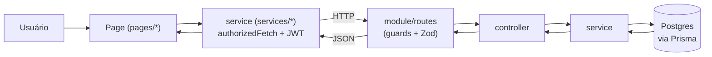

# Mapa do código — SerraAthlo

Guia de **onde cada coisa mora, pra que serve e como se conecta**. Pensado pra
quem chega novo se localizar rápido, sem precisar abrir o projeto inteiro.

> Como este doc se encaixa nos outros:
> - **[README.md](../README.md)** → o que é o app + como rodar (comece por aí).
> - **[ARCHITECTURE.md](../ARCHITECTURE.md)** → decisões e o "porquê" das convenções.
> - **Este arquivo (CODE_MAP.md)** → o "onde" e o "o quê": mapa de pastas/arquivos.
> - **[HANDOFF.md](../HANDOFF.md)** → estado/continuidade do trabalho em andamento.

---

## 1. Visão geral — monorepo

É um **monorepo sem workspaces** (deps instaladas em 3 lugares: raiz, `api/`,
`frontend-vite/`). Dois apps + configs compartilhadas na raiz.

```
Treinamento/
├── frontend-vite/   → Web (React 19 + Vite + TS, PWA). O que o usuário vê.
├── api/             → Backend (Express + Prisma + Postgres). Regras + dados.
├── docs/            → Documentação (setup, checklists, este mapa).
├── e2e/             → Testes end-to-end (Playwright).
├── loadtest/        → Testes de carga.
├── deploy/          → Artefatos/scripts de deploy.
├── eslint-plugins/  → Regras ESLint custom do projeto.
├── package.json     → Scripts que orquestram web+api (dev, build, lint, test).
├── render.yaml      → Config de deploy da API (Render).
├── playwright.config.ts, eslint.config.mjs, commitlint.config.cjs, cspell.json
```

| Arquivo raiz | Serve pra |
|---|---|
| `package.json` | Scripts guarda-chuva: `npm run dev` sobe web+api; `lint`/`typecheck`/`build`/`test` rodam nos dois lados. |
| `render.yaml` | Deploy da API no Render (roda `prisma migrate deploy` antes do boot). |
| `eslint.config.mjs` + `eslint-plugins/` | Lint com regras próprias. |
| `commitlint.config.cjs` | Valida mensagens de commit (via husky no pre-commit). |
| `cspell.json` | Corretor ortográfico (dicionários PT-BR + termos de domínio). |

---

## 2. Frontend — `frontend-vite/`

Web app React. **Entrada:** `index.html` → `src/main.tsx` (monta o React +
providers) → `src/App.tsx` (define as rotas). PWA via `vite-plugin-pwa`
(`src/sw.ts` = service worker).

### 2.1 `src/` — estrutura

```
src/
├── main.tsx          Ponto de entrada: createRoot + providers globais.
├── App.tsx           Rotas (react-router) → cada rota renderiza uma page.
├── sw.ts             Service worker (PWA: cache + push notifications).
├── pages/            Uma tela por rota (+ subpastas por página grande).
├── components/       UI compartilhada entre páginas.
├── services/         Chamadas à API (1 arquivo por domínio).
├── hooks/            Hooks reutilizáveis (useXxx).
├── lib/              Utilitários puros + caches client-side (sem React).
├── context/          Contextos React globais (Auth).
├── types/            Tipos TypeScript compartilhados (1 por domínio).
├── assets/           Imagens/estáticos.
└── test/             Setup do Vitest.
```

### 2.2 `pages/` — telas (por rota)

Cada arquivo `XxxPage.tsx` é uma tela ligada a uma rota em `App.tsx`. Páginas
**grandes** têm uma **subpasta com o mesmo tema** onde vivem seus subcomponentes,
utils e hooks — ver o [padrão de decomposição](#26-o-padrão-god-file--pasta).

Agrupadas por área:

| Área | Páginas (rota) | Subpasta |
|---|---|---|
| **Auth / onboarding** | Login (`/login`), Register, ForgotPassword, GoogleCallback, Onboarding | — |
| **Treino** | Workouts (`/workouts`), **Train (`/train`)**, WorkoutDetail, WorkoutRecommendations, **AIWorkout (`/ai-workout`)** | `train/`, `workouts/`, `ai/` |
| **Progresso / exercícios** | Progress (`/progress`), ExerciseDetail, RecommendationDetail | `progress/` |
| **Social** | Feed (`/feed`), Post, Profile, PublicProfile (`/u/:id`), SharedPlan (`/shared/:token`) | `profile/`, `home/` |
| **Desafios** | Competitions (`/desafios`), CompetitionDetail, CompetitionInvite | — |
| **Config / planos** | Settings (`/settings`), Subscription | `settings/`, `subscription/`, `legal/` |
| **Suporte** | Support, SupportTicket | — |
| **Admin** | AdminUsers (`/admin/users`), AdminProInvites, AdminSupport* | `admin/` |
| **Home** | HomePage (`/dashboard`) | `home/` |

**Subpastas de página (destaques):**
- **`pages/train/`** (~48 arquivos) — a maior. Telas do fluxo de treino ao vivo
  (`TrainActiveScreen`, `TrainDashboardScreen`, `TrainSummaryScreen`, …), cards e
  sheets (`ActiveExerciseCard`, `RestTimerBar`, `RoutineCard`, `SupersetPickerSheet`),
  e a lógica pura em `.ts` (`workout-session-reducer.ts`, `helpers.ts`,
  `set-display.ts`, `superset.ts`, `cardio.ts`, `types.ts`). Todo o estado/lógica
  (reducer de sessão + handlers + efeitos) vive no hook `useTrainSession.ts`; a
  `TrainPage.tsx` (raiz de `pages/`) virou um **container fino** que só chama esse
  hook e roteia as telas.
- **`pages/ai/`** (~12) — gerador de treino por IA: telas do quiz/review/result
  (`AIQuizScreen`, `AIReviewScreen`, `AIResultScreen`, …), o hook `useAIWorkout.ts`
  (todo o estado/lógica) e utils (`ai-workout-utils.ts`). A `AIWorkoutPage.tsx`
  virou um container fino que só chama o hook e roteia as telas.
- **`pages/workouts/`** — editor rico de rotinas decomposto: `CreatePlanCard`,
  `PlanHeader`, `ExerciseCard`, `PlanCardioPanel`, `WorkoutPlanCard` (card de 1 rotina)
  e `WorkoutPlanModals` (cluster de sheets/modais). A `WorkoutsPage.tsx` orquestra o
  estado + monta essas partes.
- **`pages/progress/`** — abas extraídas (`ProgressExerciseTab`, `ProgressBodyTab`) +
  gráficos (`charts`), medidas (`measurements`), card de exercício e utils. A
  `ProgressPage.tsx` fica com o estado + header/hero/heatmap + roteamento das 2 abas.
- **`pages/admin/`, `profile/`, `settings/`, `home/`, `legal/`** — mesmo espírito:
  subcomponentes/utils da respectiva página.

### 2.3 `components/` — UI compartilhada

Componentes usados por **várias** páginas (o que é específico de uma página fica
na subpasta dela).

| Subpasta | Conteúdo |
|---|---|
| `common/` (~35) | Blocos genéricos: `ConfirmDialog`, `InfoDialog`, `Skeleton`, `WorkoutShareEditor`, toasts, avatares, cards de feed, etc. |
| `layout/` | Casca do app (`AppShell` — navegação inferior, header). |
| `competition/` (~14) | UI de desafios. |
| `plan/` | Limite de plano (FREE/PRO): `PlanLimitDialog`, `use-plan-limit`. |
| `auth/`, `legal/` | Guards de rota / conteúdo legal. |

### 2.4 `services/` — a ponte com a API

**1 arquivo por domínio.** Cada função faz `fetch` autenticado a um endpoint da
API e devolve dados já tipados. É a **única** camada que o front usa pra falar com
o backend — páginas/hooks chamam services, nunca `fetch` cru.

`authService`, `workoutService`, `aiService`, `progressService`, `socialService`,
`competitionService`, `exerciseService`, `recommendationService`, `notificationService`,
`pushService`, `subscriptionService`, `supportService`, `adminService`.

### 2.5 `hooks/`, `lib/`, `context/`, `types/`

- **`hooks/`** — hooks reutilizáveis: `useAuth` (sessão/tokens), `useTheme`,
  `useToast`, `usePushNotifications`, `useWakeLock`, `useActiveWorkoutElapsed`
  (cronômetro do treino), `useCompetition(Realtime)`, `useAdminUsers`, `useScrollLock`.
- **`lib/`** — utilitários **puros** (sem React) e caches client-side:
  - `cache/` — caches em memória (planos, catálogo de exercícios, histórico).
  - `workout/` — timing, storage do treino ativo (localStorage), imagem da sessão.
  - `exercise/` — metadados/catálogo/recentes de exercícios.
  - `image/` — otimização/hash de imagem. `infra/` — Sentry, etc.
  - soltos: `plan-features.ts` (erros de limite de plano), `haptics.ts`, `share.ts`.
- **`context/`** — `AuthContext.tsx` (provider) + `auth-context.ts` (o contexto).
  Guarda usuário logado + `authorizedFetch` (fetch com JWT + refresh automático).
- **`types/`** — tipos compartilhados por domínio: `workout.ts`, `auth.ts`,
  `competition.ts`, `exercise.ts`, `progress.ts`, `admin.ts`.

### 2.6 O padrão "god-file → pasta"

Quando uma página cresce demais, ela é quebrada assim (ver ARCHITECTURE / HANDOFF):
mover JSX+handlers **verbatim** pra um componente/tela na subpasta; só
item/índice/handlers viram **props**; o **estado fica no pai**. O `.tsx` só
exporta componentes (regra `react-refresh`) → consts/tipos/funções puras vão pra
um `.ts` irmão. O TypeScript pega 0-erro-de-prop = rede de segurança forte.
`pages/train/` e `pages/ai/` são os exemplos mais maduros desse padrão.

---

## 3. Backend — `api/`

Express + Prisma. **Entrada:** `src/server.ts` (sobe o HTTP) → `src/app.ts`
(monta middlewares + rotas).

```
api/src/
├── server.ts       Boot do servidor HTTP.
├── app.ts          Monta Express: middlewares + rotas.
├── routes/         Registro central que pluga os módulos.
├── config/         env (validado por Zod), prisma client, sentry, redis.
├── middlewares/    auth, segurança (helmet/cors/rate-limit/sanitize), erros.
├── modules/        1 pasta por domínio (o coração — ver abaixo).
├── shared/         utils/serviços transversais (event-log, account-type, …).
└── types/          tipos do backend.
api/prisma/         schema.prisma + migrations/ + seed + scripts de catálogo.
api/tests/          testes de integração (Jest).
```

### 3.1 Padrão por módulo (`api/src/modules/<domínio>/`)

Cada domínio segue **4 camadas** (mesma explicação no ARCHITECTURE):

```
routes      rota + guards (auth/role) + validação Zod
   ↓
controller  entrada/saída HTTP (req → chama service → res)
   ↓
service     regra de negócio + acesso ao banco (Prisma)
   ↓
schema      Zod (valida corpo/query) + tipos inferidos
```

Domínios existentes: `auth`, `workout`, `ai`, `progress`, `social`, `competition`,
`exercise`, `recommendation`, `notification`, `push`, `subscription`, `support`,
`admin`, `dashboard`, `engagement`, `upload`, `cron`, `security`, `health`.

### 3.2 `prisma/`

`schema.prisma` = fonte da verdade do banco. `migrations/` = histórico versionado
(aplicadas com `prisma migrate`; em produção o Render roda `migrate deploy` no boot).
`seed` + scripts (`add-exercises.ts`, `*-standardization.ts`, …) populam/mantêm o
catálogo de exercícios.

---

## 4. Como tudo se conecta (fluxo de uma requisição)



Resumo em palavras: **página** → chama uma função do **service** (que anexa o JWT
via `authorizedFetch` do `AuthContext`) → bate na **rota** do módulo (que valida
com Zod e checa auth) → **controller** → **service** (regra + Prisma) →
**Postgres** → volta como JSON tipado até a UI.

**Auth:** login gera JWT access+refresh; `AuthContext` guarda e injeta em toda
chamada; quando o access expira, o `authorizedFetch` renova via refresh sozinho.

---

## 5. Convenções de nome/arquivo (resumo)

| Padrão | Regra |
|---|---|
| Componentes React | `PascalCase.tsx`, **só exportam componentes** (react-refresh). |
| Utils/lógica pura | `kebab-case.ts` (ex.: `ai-workout-utils.ts`, `set-display.ts`). |
| Hooks | `useXxx.ts` (ex.: `useAuth.ts`, `useAIWorkout.ts`). |
| Testes | `*.test.ts(x)` ao lado do arquivo testado (Vitest no front, Jest na api). |
| Services (front) | 1 arquivo por domínio, espelham os módulos da API. |
| Módulos (api) | `routes` → `controller` → `service` → `schema`. |

---

## 6. "Onde encontro…?" (referência rápida)

| Quero… | Vá em |
|---|---|
| Adicionar/mudar uma **rota** de tela | `frontend-vite/src/App.tsx` |
| Mexer numa **tela** | `frontend-vite/src/pages/<Xxx>Page.tsx` (+ subpasta) |
| Mudar uma **chamada à API** (front) | `frontend-vite/src/services/<domínio>Service.ts` |
| Criar/alterar **endpoint** | `api/src/modules/<domínio>/` (routes/controller/service/schema) |
| Mudar o **banco** (tabelas/colunas) | `api/prisma/schema.prisma` + `prisma migrate` |
| UI reutilizável | `frontend-vite/src/components/common/` |
| Regra de **segurança/auth** | `api/src/middlewares/` |
| Config de ambiente (backend) | `api/src/config/` + `api/.env` |
| Deploy | `render.yaml` (API) · Vercel (web, automático na branch de produção) |

---

## 7. Manutenção deste documento

Mantenha este mapa **em dia sempre que a estrutura mudar** — ao **adicionar,
mover, remover ou renomear** arquivos/pastas relevantes (nova página, novo módulo
da API, nova pasta de decomposição, etc.). Não é preciso listar cada arquivo
individual; o objetivo é que as **pastas e os pontos de entrada** sempre reflitam
a realidade. Mudanças pequenas dentro de um arquivo não exigem atualização aqui.
